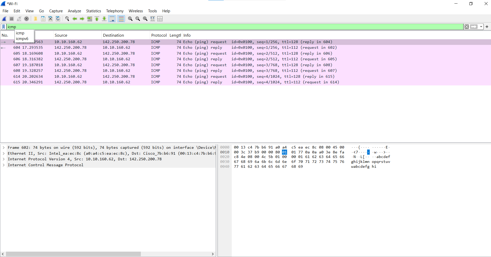
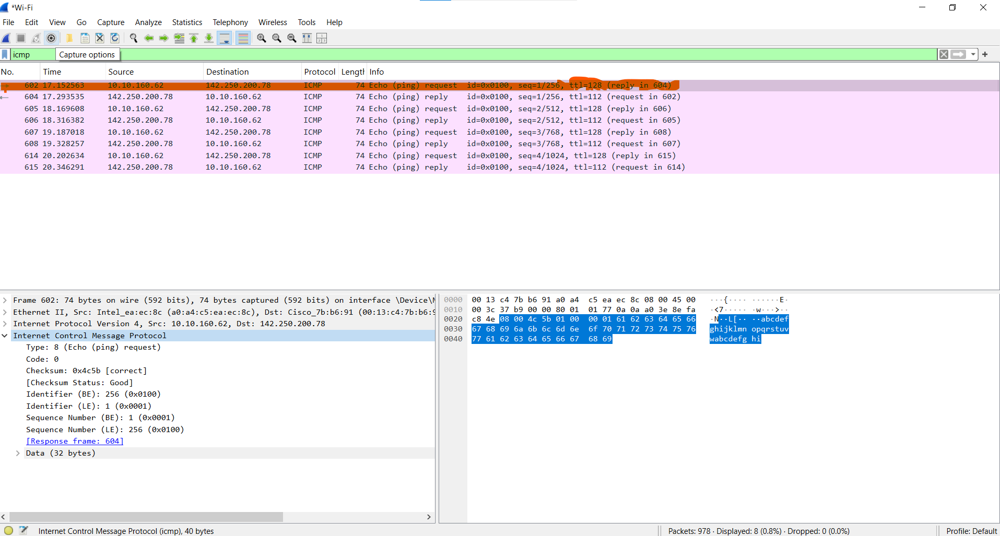
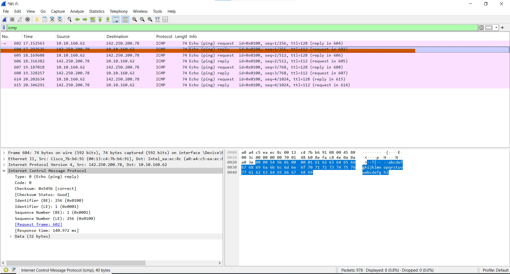

# ICMP Echo Request and Reply Analysis

## Overview
This project focuses on analyzing **ICMP Echo Request and Echo Reply** packets captured using Wireshark. It simulates the common use of the `ping` command to understand how ICMP operates at the network layer.

---

## Packet Capture Summary

- **Command Used:** `ping example.com`
- **Tool:** Wireshark
- **Filter Applied:** `icmp`

Three screenshots were taken during this analysis:
1. Echo Request and Echo Reply side by side in the capture list.
2. Detailed breakdown of Echo Request.
3. Detailed breakdown of Echo Reply.

---

## Screenshots

| Capture View | Description |
|--------------|-------------|
|  | ICMP Echo Request and Reply side by side |
|  | Expanded breakdown of ICMP Echo Request packet |
|  | Expanded breakdown of ICMP Echo Reply packet |

---

## Key Insights

- **ICMP Type 8** = Echo Request  
- **ICMP Type 0** = Echo Reply  
- Both messages include identifiers and sequence numbers used for tracking replies.
- This basic test confirms host reachability and round-trip response.

---

## Conclusion

This analysis provided a low-level view of how the `ping` command works. Understanding ICMP traffic is crucial for diagnosing basic network connectivity issues.

